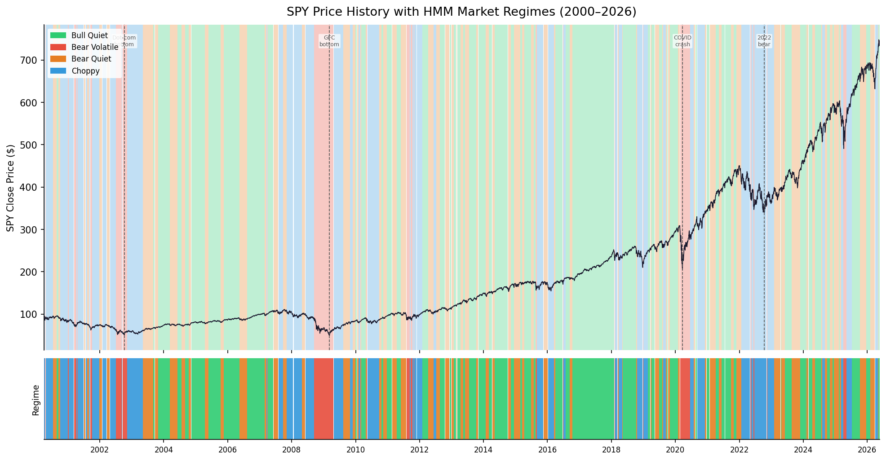
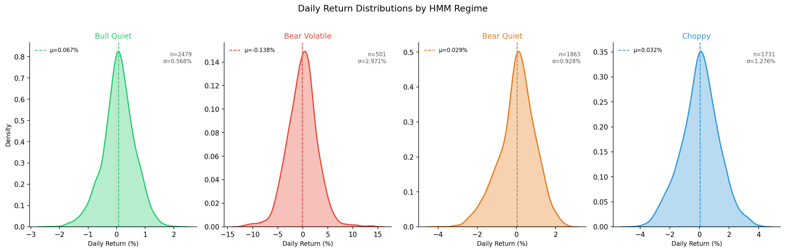
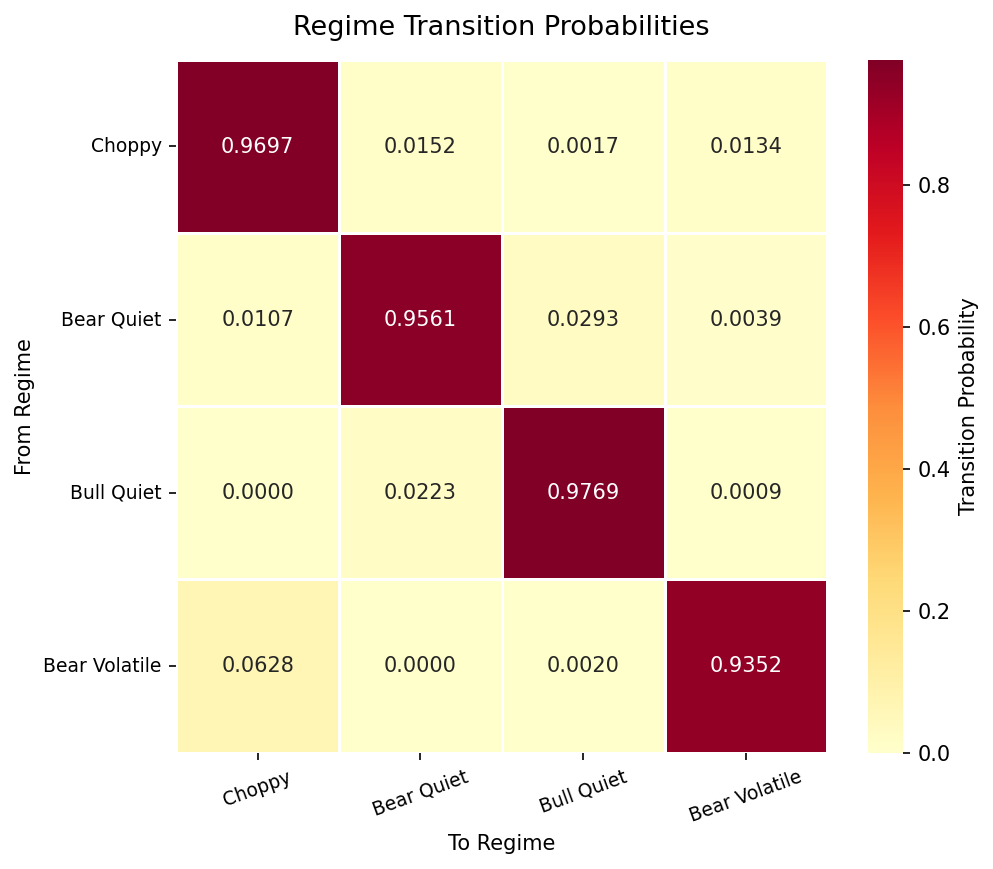

# Market Regime Detector

Unsupervised market regime classification using Hidden Markov Models and
Gaussian Mixture Models on 26 years of SPY data (2000–2026).

## Regimes

| Regime        | Days  | % of History | Mean Return | Mean Vol |
|---------------|-------|--------------|-------------|----------|
| Bull Quiet    | 2479  | 37.7%        | +0.067%     | 0.553%   |
| Bear Quiet    | 1863  | 28.3%        | +0.029%     | 0.900%   |
| Choppy        | 1731  | 26.3%        | +0.032%     | 1.371%   |
| Bear Volatile | 501   | 7.6%         | -0.138%     | 2.598%   |

## Results

- HMM vs GMM agreement rate: 68.3%
- HMM chosen as primary model — transition memory makes regimes more stable
- Bear Volatile correctly identifies 2008 GFC, 2020 COVID crash, 2022 bear market

## Sample Plots





## How to Run

```
pip install -r requirements.txt
python3 data/fetch.py
python3 data/features.py
python3 train_hmm.py
python3 train_gmm.py
python3 visualize.py
python3 regime_detector.py   # prints today's regime report
```

## Integration with Trading Bot

```python
from regime_detector import get_current_regime, get_regime_recommendation

regime, confidence = get_current_regime()
rec = get_regime_recommendation(regime)

if rec["trade"]:
    position_size = rec["position_size"]
    # scale your bot's position by position_size
else:
    # skip trading today
```

## Project Structure

```
market-regime-detector/
├── data/
│   ├── fetch.py
│   ├── features.py
│   ├── spy_raw.csv
│   ├── spy_features.csv
│   ├── spy_regimes_hmm.csv
│   └── spy_regimes_gmm.csv
├── models/
│   ├── hmm_model.py
│   ├── gmm_model.py
│   ├── hmm_model.pkl
│   ├── gmm_model.pkl
│   └── hmm_scaler.pkl
├── results/plots/
├── train_hmm.py
├── train_gmm.py
├── visualize.py
├── regime_detector.py
└── README.md
```
